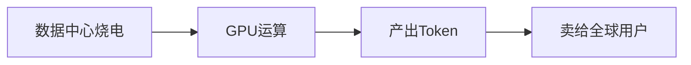

# AI让电力销售找到新出路

-- 经由AI，五毛一度的中国电，换个姿势能卖11元。

- [AI让电力销售找到新出路](#ai让电力销售找到新出路)
  - [背景](#背景)
  - [Token -- 智能时代的标准化集装箱](#token----智能时代的标准化集装箱)
  - [通过Token完成电力出口的供应链实例](#通过token完成电力出口的供应链实例)
  - [中国电力的规模与困境](#中国电力的规模与困境)
  - [电力借由Token出口的思路转变](#电力借由token出口的思路转变)
  - [从生意的角度看通过Token的电力出口](#从生意的角度看通过token的电力出口)
    - [电力经由电解铝行业出口](#电力经由电解铝行业出口)
    - [电力经由多晶硅行业出口](#电力经由多晶硅行业出口)
    - [电力经由Token出口](#电力经由token出口)
  - [为什么中国只能卖22倍，美国能卖785倍？](#为什么中国只能卖22倍美国能卖785倍)
  - [中国AI长期上的结构性问题](#中国ai长期上的结构性问题)
  - [总结](#总结)

## 背景

1956年，美国商人麦克莱恩发明了集装箱。

在集装箱之前，货物出口靠的是人力散装，一件一件靠叉车、吊机搬运，一船要装卸好几天，运输成本里有一半是装卸费。集装箱出现，让这一切变了--**任何**货物，只要装进集装箱，就能被**任何**港口的吊车装卸，被**任何**货轮运输，被**任何**买家接收。

简单的发明，却带来了非凡的效益，它让全球贸易的摩擦成本大幅下降，当中国成为“世界工厂”后，中国产能借由集装箱渗透到了全球每个角落。

70年后，一个新的“集装箱”出现了，叫作Token(词元)。

Token是大语言模型处理文字的最小单元，大致相当于半个中文字。但它的意义不在于这个技术定义，而在于它做到了和集装箱一样的事：把原本难以计量、难以交易的东西--智能服务--装进了一个标准化的容器！

一个问题、一段代码、一篇文章，背后消耗了多少算力，全部可以用Token来计量、定价、交易。这就像集装箱让任何货物都能被吊车装卸，Token让任何智能服务都能被API调用、被计量、被出口。

美国掀起了这场AI浪潮，现在中国第一次有机会大规模出口脑力，而不是体力、矿产、能源。

## Token -- 智能时代的标准化集装箱

Token，对应中文叫“词元”，是大语言模型处理文本的最小单位。

- “我喜欢吃苹果”：对人类来说是一个完整的句子，对AI来说，它是“我”，“喜欢”，“吃”，“苹果”四个Token。
- 英文更加复杂，“ChatGPT”会被拆成"Chat","G","PT"三个Token.

这种拆分看起来琐碎，但它让智能服务第一次变得可以量化，可以被公平地计算，就像集装箱一般，Token让任何智能服务都能被计量、被交易、被出口。

## 通过Token完成电力出口的供应链实例

一个印度的创业者，打开电脑，调用DeepSeek的API，让它帮他写一段Python代码。他等了不到一秒，代码出现了，他付了几分钱，关上电脑。

这个动作很简单，但背后发生的事情却改写了游戏规则：他的请求通过光纤传到了中国某个数据中心，数百块GPU同时启动，开始逐字生成那段代码。

每生成一个字，就要消耗若干Token，而每个Token背后，却是真实的电力消耗。甘肃的风电、青海的光伏、云南的水电，在这一刻以Token的形式，打包跨越国境，变成印度程序员眼前的一行代码。

中印之间没有特高压输电线路，但中国的电力，却实实在在地被国外消费了。

这就是Token出口的本质：

在这个过程中，电力和算力被**隐形**地打包进每一个Token，随着API调用流向世界各地。买家买到的是智能服务，但他们实际上消费的，是中国的电力、算力和工程师的智识积累。

这个机制有一个关键的特性：它不需要买家在地理上靠近中国，不需要铺设任何物理管道，只需要一根网线。这是传统电力出口永远做不到的事。

## 中国电力的规模与困境

中国电力至强大，天下人所共知，2025年，中国光伏装机突破3.15亿千瓦，占全国新增发电装机的57%.

然而装机越快，消纳越难，[全国新能源消纳监测预警中心](https://baike.baidu.com/item/%E5%85%A8%E5%9B%BD%E6%96%B0%E8%83%BD%E6%BA%90%E6%B6%88%E7%BA%B3%E7%9B%91%E6%B5%8B%E9%A2%84%E8%AD%A6%E4%B8%AD%E5%BF%83/22505217)的数据显示：2025年上半年，全国光伏弃电率升至6.6%，风电弃电率5.7%，比2024年同期几乎翻倍。

西部省份的困境尤其严重：2025年1月至11月，西藏光伏发电利用率仅65.8%，甘肃89.6%，青海83.5%，西藏风电利用率更只有69.3%。大量可再生能源发出来，却没有地方消纳，白白浪费！

面对这些过剩的电，能不能直接出口？现实却不简单，下面是多方面的挑战 --

1. 电不能装箱，不能储存，只能靠实体电网点对点输送。然而中国西部弃风弃光最严重的地方--西藏、甘肃、内蒙古--偏偏与电网基础设施最薄弱的国家接壤，这些国家中基本上没有全国性的电网。
2. 云南通过21条输电线路与越南、缅甸、老挝联网，十三五期间累计跨境交易电量176亿千瓦时--这个数字相比中国每年数万亿千瓦时的总发电量，几乎可以忽略不计。
3. 另一方面，每个国家都有主权，不会让本国电力过于依赖邻国供应，并且出口电价也会被压的很低，基本上在五毛钱作用，还要再扣除损耗和交易成本，所以这也成为了电力出口的天花板。

## 电力借由Token出口的思路转变

现在，我们将电力换个“皮”，通过Token的出口，情况就大为改观，其不需要物理电网，不受电力主权约束，价格不被大宗商品市场锚定--这是一条真正可以规模化的新路。

数据中心对电价敏感、但对位置不敏感--光纤可以跨越千山万水。西藏、甘肃、青海的过剩绿电，可以通过数据中心转化为Token，出口到全球。

这一点，在面向最终用户(ToC)的市场上尤其意义重大--ToC的意义在于它是最敏感的风向标。中国个人用户的AI使用习惯正在发生结构性转变：从“问答”转向“干活”。编程、写作、长文档处理，每一类场景的Token消耗都远高于简单对话。加上深度推理模式的普及，单个用户单次调用的Token量在快速膨胀--业界把这个现象称为“**Token通胀**”。

数字也印证了这个趋势。
- 国家数据局数据显示，2024年出中国日均Token消耗量为1000亿，到2025年6月底已突破30万亿，一年半时间增长了300倍。
- 2025年上半年，中国公有云大模型调用总量达到537万亿Token，较2024年全年增长近400%。

这个增速，远超任何一个传统行业的成长曲线。中国的澎湃电力，正经由Token外皮，被国内外市场无形却大量的购买。

## 从生意的角度看通过Token的电力出口

卖Token，是一门暴利生意。

其实，“电力换皮出口”这事儿，中国早有先例。

### 电力经由电解铝行业出口

中国是全球最大的电解铝生产国，但铝土矿本身大量依赖进口--几内亚、澳大利亚、印度尼西亚的矿石，飘洋过海运到中国，在西南、西北的电解铝工厂里，经过高耗电的冶炼工序，变成铝锭，再出口到全球。

矿石是进口的，铝锭是出口的，而最耗电的那个环节，留在了国内。

也就是说，中国出口的铝锭里，有相当一部分是电力在换皮出售。只是，这种方式增值倍数不高：一度电编程铝锭，大约只能增值2到3倍。

生成1吨电解铝，行业平均耗电约13500度，也就是说1度电大约能炼出 1/13500=74克铝。铝锭目前的市场价大约是每吨2万元，74克铝价值约1.48元。而这1度电，买入价不过0.3到0.4元。

这样粗算下来，1度电通过炼铝增值了3到5倍。

### 电力经由多晶硅行业出口

生产1吨多晶硅，综合电耗约57000度，也就是说1度电大约能生产17.5克多晶硅。目前多晶硅现货价格约为4万元每吨，17.5克价值约0.7元。同样1度电的买入价约0.3到0.35元，则炼出多晶硅后增值约2倍。

看起来比电解铝要低，但这是因为多晶硅行业目前产能严重过剩，在2022年高点的时候，17.5克多晶硅能卖到5元以上，也就是可以增值10倍。

### 电力经由Token出口

现在讨论将电力换皮成Token出口卖出去的情况。

H100 GPU在推理场景下，每Token约消耗0.39焦耳，1度电则是360万焦耳，理论上可产出920万Token, 考虑到散热、网络、冗余等损耗，保守估算1度电实际产出约550万Token。

Token卖多少钱？
- DeepSeek输出定价每百万Token约2元
- OpenAI的GPT-4o定价每百万Token约70元

1度电直接出口，卖0.5元，炼成铝锭卖出去是1.5元，而“喂给”数据中心跑推理，按DeepSeek的定价，能卖出约11元，是直接卖电的22倍。

更重要的是，铝锭和多晶硅的工艺早已固定，早就碰到天花板了，但AI还年轻。

Token，是中国迄今为止电力增值效率最高的出口形态。

甚至，这看似暴利的“22倍”系数，还是我们厂商竞争过于激烈，主动压价的结果，不是能力天花板。

DeepSeek在打市场、抢份额，定价是战略选择。DeepSeek-V3的训练成本仅约3900万元，用的是H800芯片--国产模型的真实成本，比这个定价还要低得多。即使把价格压到OpenAI的1/20，中国模型依然有利润空间。

## 为什么中国只能卖22倍，美国能卖785倍？

上面分析了中国这边的帐，现在再看看美国那边的帐。

DeepSeek用1度电转化出的Token可以卖11元，如果换成OpenAI的定价，同样Token则能卖约385元，增值倍数达到785倍。

22倍和785倍之间，差着一个数量级。

首先，这里最直接的原因是品牌溢价缺失造成的！

这就好比同样是矿泉水，农夫山泉卖2元，依云卖30元，不是因为依云的水分子更高级，而是因为依云卖的是阿尔卑斯山泉这个故事。

OpenAI也是同样的到了--它卖的不只是Token，卖的是全球最强AI这个认知。这个认知本身值钱，而且能让人愿意为之多付钱。

Claude Sonnet输出定价每百万Token约105元，MiniMax M2.5只要约8元，相差13倍。

用户愿意为Claude买单，不只是因为Claude测试结果优异，还因为他们相信Claude确实更好。

中国模型厂商目前还处于农夫山泉的阶段，价格透明、童叟无欺，但品牌故事还没讲出来。

其次，是模型能力的差距。

DeepSeek在数学、编程的基准测试上已经追平甚至超越OpenAI，但基准测试是考场，生产环境是战场。

在实际的企业应用里，稳定性、指令遵循的精确度、边缘情况的处理才是核心。实际的能力差距，直接影响定价天花板--你能解决别人解决不了的问题，才有资格开更高的价。中国模型目前还在追赶高端场景，这个差距缩小一分，定价空间就能打开一分。

第三，则是生态和信任的缺失。

企业客户选择AI供应商，就像选银行，不只看利率，还要看这家银行会不会突然倒闭、出了问题有没有人接电话。

OpenAI和微软Azure背后有完整的企业服务体系--SLA保障、合规支持、技术文档、售后响应，这套东西是多年积累下来的信任背书。中国模型在工程能力上完全不输，但这套售后体系还在建设中。

最后还有一道隐形的压力，地缘政治折扣。

简单说就是，很多客户想用但不敢用，或者用了也要压价，因为心里有顾虑--今天能调的API，明天会不会被自己国家的监管部门叫停？美国联邦机构禁用DeepSeek，德国要求下架，这些新闻每出一条，都会让潜在客户的决策再迟疑一下。迟疑折算成价格，就是折扣。

以上四个原因叠加，形成了一种结构性的定价压制。

22倍是现在的成绩，不是终点。但从22倍走向更高，靠的不是更猛的减价，而是品牌、能力、生态、信任的一点一点积累。

## 中国AI长期上的结构性问题

第一是算力天花板。

芯片禁令不会消失，美国必然会管得越来越严。

DeepSeek用H800训练出了顶级模型，这是一次了不起的工程奇迹，但奇迹不能当战略。如果下一代模型需要十万张H100，而中国只能拿到性能打折的替代品，训练成本优势就会被侵蚀。

第二是数据本地化压力。

各国对数据主权的限制也在越发收紧，欧盟的GDPR、印度数据本地化法案、中东的合规要求，都在往同一个方向推。

目前中国Token出口依赖的是纯境外API调用模式，一旦各国要求数据不能出境，就得在当地建数据中心。可若是在本地建数据中心，那么土地、电力、运维全部按当地标准来，成本结构就完全变了。

因此，Token出口的终极形态，可能不是简单的API调用，而是中国技术加本地部署--这对商业模式和运营能力，都是更高的要求。

## 总结

从卖电到卖Token，中国完成了从体力活到脑力活的跃迁--不需要密集劳动、不需要污染环境、不需要物理联网，不受地缘政治的电力主权约束，价格也不再被大宗商品市场锚定，这是一条真正意义上可以规模化的新路。

---

参考来源：果壳网(2026-03-10)，转载自星海情报局(头条ID: junwu2333)