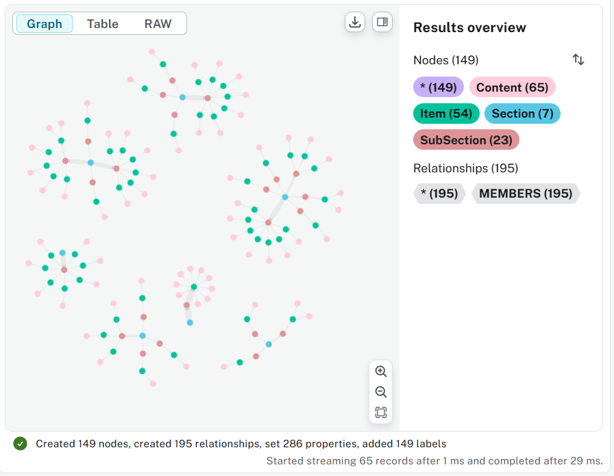

Here is the graph build up Cypher

```cypher
LOAD CSV WITH HEADERS FROM 'file:///D://GitHub//ai-ml-dl//AI//Laws-and-Regulations//US//20251124_Genesis-Mission.csv' AS row
MERGE (s1:Section {sectionId: row.SectionID, sectionName: row.SectionName})
MERGE (s2:SubSection {subSectionId: row.SubSectionID})
MERGE (s3:Item {itemId: row.ItemID})
MERGE (c:Content {contentId: row.ContentID, contentEnglish: row.ContentEnglish, contentChinese: row.ContentChinese})
MERGE (s1)-[r1:MEMBERS]->(s2)-[r2:MEMBERS]->(s3)-[r3:MEMBERS]->(c)
RETURN s1, s2, s3, c, r1, r2, r3
```

