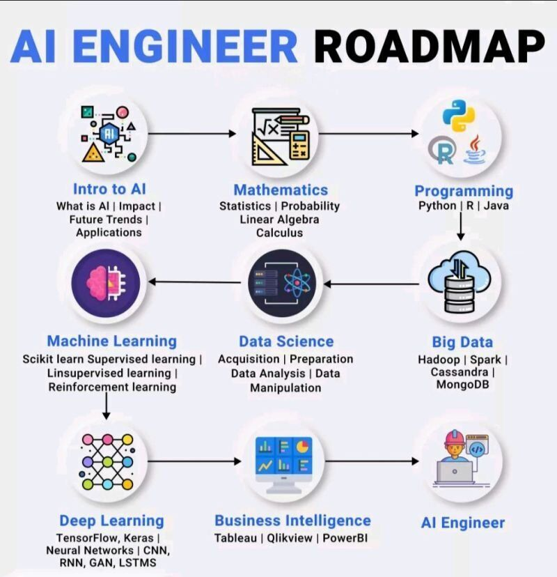
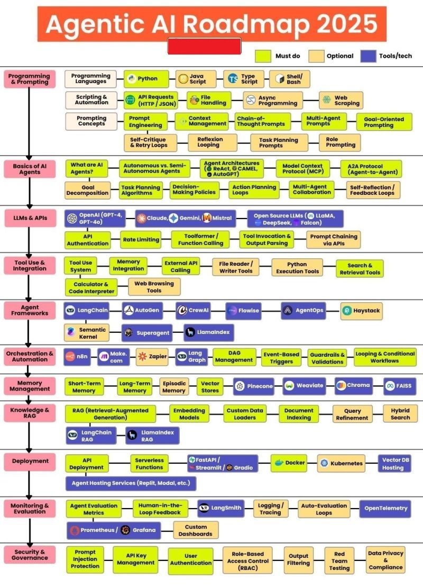

# Artificial Intelligence (AI)

- [Artificial Intelligence (AI)](#artificial-intelligence-ai)
  - [AI Engineer Roadmap](#ai-engineer-roadmap)
  - [Agentic AI Roadmap 2025](#agentic-ai-roadmap-2025)

## AI Engineer Roadmap

## Agentic AI Roadmap 2025

Thanks [SATISH GOJARATE](https://www.linkedin.com/in/satish-gojarate-a0815519)'s sharing.

| Step | Timeframe | Category | Actions | Goal |
| --- | --- | --- | --- | --- |
| 1. Build Your Programming & Prompting Base | 4~6 weeks | Learn | - Python + basic scripting (API calls, file handling) - Prompt Engineering (chain-of-thought, goal-oriented prompts) - Async processing & web scraping basics | Be able to write scripts + craft prompts that produce consistent, structured AI outputs |
| 2. Understand the DNA of AI Agents | 3~4 weeks | Learn | - What AI agents are + differece between autonomous & semi-autonomous - Goal decomposition & task planning algorithms - Architectures: ReAct, CAMEL, AutoGPT - Protocols: MCP & A2A | Know how agents think, plan, and act |
| 3. Master LLMs & APIs | 3~4 weeks | Work with | - Proprietary LLMs: OpenAI, Claude, Gemini - Open Source LLMs: LLaMA, DeepSeek, Falcon - API authentication, rate limits, tool/function calling | Connect to any model, send it structured requests, and parse outputs |
| 4. Tool Use & Integration | 2~3 weeks| Learn | - Momory integration - External API calling - Search & retrieve tools - File & code execution | Make your agent use tools like a human assistant |
| 5. Choose & Master an Agent Framework | 4~6 weeks | Try | - LangChain, AutoGen, CrewAI, Flowise, AgentOps - Understand orchestration between multiple agents | Build multi-agent workflows with a chosen framework. |
| 6. Orchestrate & Automate | 2~3 weeks | Learn | - n8n, Make.com, Zapier, LangGraph - Event triggers, DAGs, conditional flows, guardrails | Automate complex, reliable AI pipelines |
| 7. Add Memory, RAG & Knowledge Systems | 3~4 weeks | Work with | - Vector databases: Pinecone, Weaviate, Chroma, FAISS - RAG pipelines, document indexing, hybrid search | Give your agents contextual memory + external knowledge. |
| 8. Deploy, Monitor & Govern | 3~4 weeks | Learn | - Deploy with FastAPI, Docker, Kubernetes - Monitor via LangSmith, Prometheus, Grafana - Apply security & compliance (RBAC, privacy, red teaming) | Ship secure, production-grade agents |

---

Updated at Sept 15th, 2025