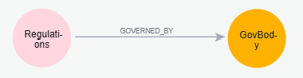

# Creating AI Knowledge into Graph

## Add AI Laws and Regulations Node

```cypher
LOAD CSV WITH HEADERS FROM 'file:///D://GitHub//ai-ml-dl//Laws-and-Regulations//AI_Regulations.csv' AS row
MERGE (r:Regulations {name: row.name})
SET
    r.country = row.country,
    r.scope = row.scope,
    r.riskClassification = row.riskClassification,
    r.penalties = row.penalties,
    r.transparencyRequirements = row.transparencyRequirements,
    r.effectiveDate = row.effectiveDate,
    r.enforcementAuthority = row.enforcementAuthority,
    r.smallBusinessExemption = row.smallBusinessExemption,
    r.regulatorySandbox = row.regulatorySandbox,
    r.humanOversightRequirement = row.humanOversightRequirement
RETURN r
```

Consider there will be duplicated value in `country` property, refactor to create `GovBody` node from `country` property:

```cypher
MATCH (r:Regulations)
MERGE (c:GovBody {name: r.country})
MERGE (r)-[g:GOVERNED_BY]->(c)
RETURN r,g,c
```

After this refactoring, the schema is like below:

