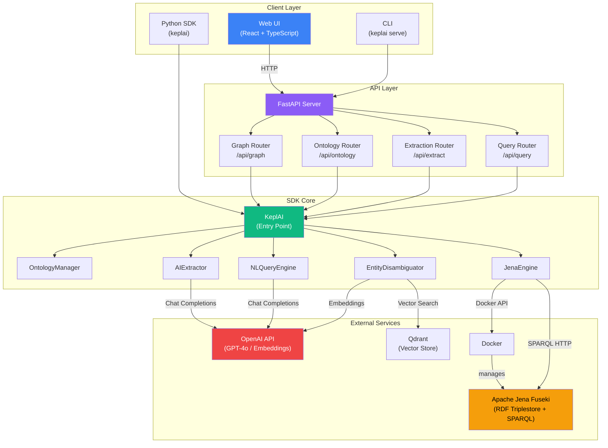

# kepl.ai

## keplai's architecture

```mermaid
graph TB
    subgraph Client Layer
        UI["Web UI<br/>(React + TypeScript)"]
        SDK["Python SDK<br/>(keplai)"]
        CLI["CLI<br/>(keplai serve)"]
    end

    subgraph API Layer
        API["FastAPI Server"]
        GR["Graph Router<br/>/api/graph"]
        OR["Ontology Router<br/>/api/ontology"]
        ER["Extraction Router<br/>/api/extract"]
        QR["Query Router<br/>/api/query"]
    end

    subgraph SDK Core
        KG["KeplAI<br/>(Entry Point)"]
        OM["OntologyManager"]
        EX["AIExtractor"]
        NLQ["NLQueryEngine"]
        DIS["EntityDisambiguator"]
        ENG["JenaEngine"]
    end

    subgraph External Services
        FUSEKI["Apache Jena Fuseki<br/>(RDF Triplestore + SPARQL)"]
        OPENAI["OpenAI API<br/>(GPT-4o / Embeddings)"]
        QDRANT["Qdrant<br/>(Vector Store)"]
        DOCKER["Docker"]
    end

    UI -->|HTTP| API
    SDK --> KG
    CLI --> API

    API --> GR
    API --> OR
    API --> ER
    API --> QR

    GR --> KG
    OR --> KG
    ER --> KG
    QR --> KG

    KG --> OM
    KG --> EX
    KG --> NLQ
    KG --> DIS
    KG --> ENG

    ENG -->|Docker API| DOCKER
    DOCKER -->|manages| FUSEKI
    ENG -->|SPARQL HTTP| FUSEKI

    EX -->|Chat Completions| OPENAI
    NLQ -->|Chat Completions| OPENAI
    DIS -->|Embeddings| OPENAI
    DIS -->|Vector Search| QDRANT

    style UI fill:#3b82f6,color:#fff
    style API fill:#8b5cf6,color:#fff
    style KG fill:#10b981,color:#fff
    style FUSEKI fill:#f59e0b,color:#000
    style OPENAI fill:#ef4444,color:#fff
```