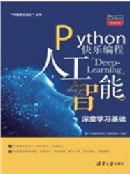

# Deep Learning 深度学习

## PyTensor

## Python 快乐编程 人工智能—深度学习基础

Demo videos are in progress putting here: [Learning PyTentor](https://www.youtube.com/playlist?list=PL6DEHvciXKeU_rOz_K8o4l-NGFYa1tyAa), enjoy.

Purchase at here: http://www.tup.tsinghua.edu.cn/wap/tsxqy.aspx?id=07866201

Note: MILA has stopped developing Theano: https://groups.google.com/d/msg/theano-users/7Poq8BZutbY/rNCIfvAEAwAJ, The PyMC developers have forked Theano to a new project called PyTensor that is being actively developed: https://github.com/pymc-devs/pytensor, so stop on using Theano.

Last updated: 2024/11/27