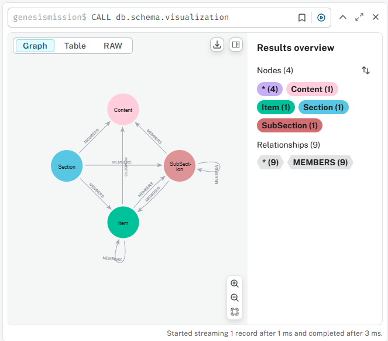
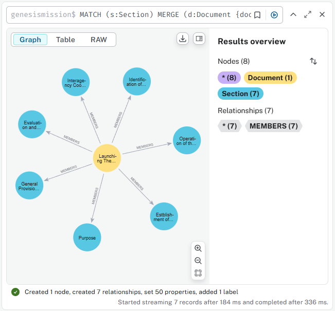
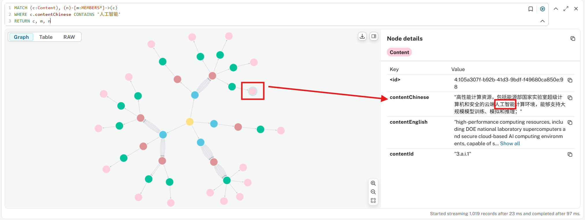

# "Genesis-Mission" Analysis in Neo4j Graph

- ["Genesis-Mission" Analysis in Neo4j Graph](#genesis-mission-analysis-in-neo4j-graph)
  - [Load Document into Graph](#load-document-into-graph)
  - [Add Document Name as Top Node](#add-document-name-as-top-node)
  - [Sample Queries](#sample-queries)
    - [Know which clause talks about 'Infrastructure'](#know-which-clause-talks-about-infrastructure)
    - [Know which clause talks about '人工智能'](#know-which-clause-talks-about-人工智能)

## Load Document into Graph

The source of the document: https://www.whitehouse.gov/presidential-actions/2025/11/launching-the-genesis-mission/

Source CSV file: [20251124_Genesis-Mission.csv](20251124_Genesis-Mission.csv)

Here is the graph build up Cypher

```cypher
LOAD CSV WITH HEADERS FROM 'file:///D://GitHub//ai-ml-dl//AI//Laws-and-Regulations//US//20251124_Genesis-Mission.csv' AS row
MERGE (s1:Section {sectionId: row.SectionID, sectionName: row.SectionName})
MERGE (s2:SubSection {subSectionId: row.SubSectionID})
MERGE (s3:Item {itemId: row.ItemID})
MERGE (c:Content {contentId: row.ContentID, contentEnglish: row.ContentEnglish, contentChinese: row.ContentChinese})
MERGE (s1)-[r1:MEMBERS]->(s2)-[r2:MEMBERS]->(s3)-[r3:MEMBERS]->(c)
RETURN s1, s2, s3, c, r1, r2, r3
```


Schema is as below:



## Add Document Name as Top Node

To prepare load more documents into the same graph for cross-querying in the future, create this "[document register](../../document_register.xlsx)" for track the `Document` node information, starting with English and Chinese two languages.

```cypher
MATCH (s:Section)
MERGE (d:Document {docName:'Launching The Genesis Mission'})
SET
  d.institute = 'White House',
  d.country = 'US',
  d.language = 'English',
  d.nameNative = 'Launching The Genesis Mission',
  d.nameChinese = '发布创世纪使命计划',
  d.type = 'Executive Order',
  d.releaseDate = date('2025-11-24')
MERGE (d)-[m:MEMBERS]->(s)
RETURN d,m,s
```

Result as below:



## Sample Queries

### Know which clause talks about 'Infrastructure'

```cypher
MATCH (c:Content)
WHERE toLower(c.contentEnglish) CONTAINS 'infrastructure'
RETURN c
```

### Know which clause talks about '人工智能'

```cypher
MATCH (c:Content), (n)-[m:MEMBERS*]->(c)
WHERE c.contentChinese CONTAINS '人工智能'
RETURN c, m, n
```

This return the `Content` nodes as well as up-to the top `Document`:



---

Updated at 2025-11-28