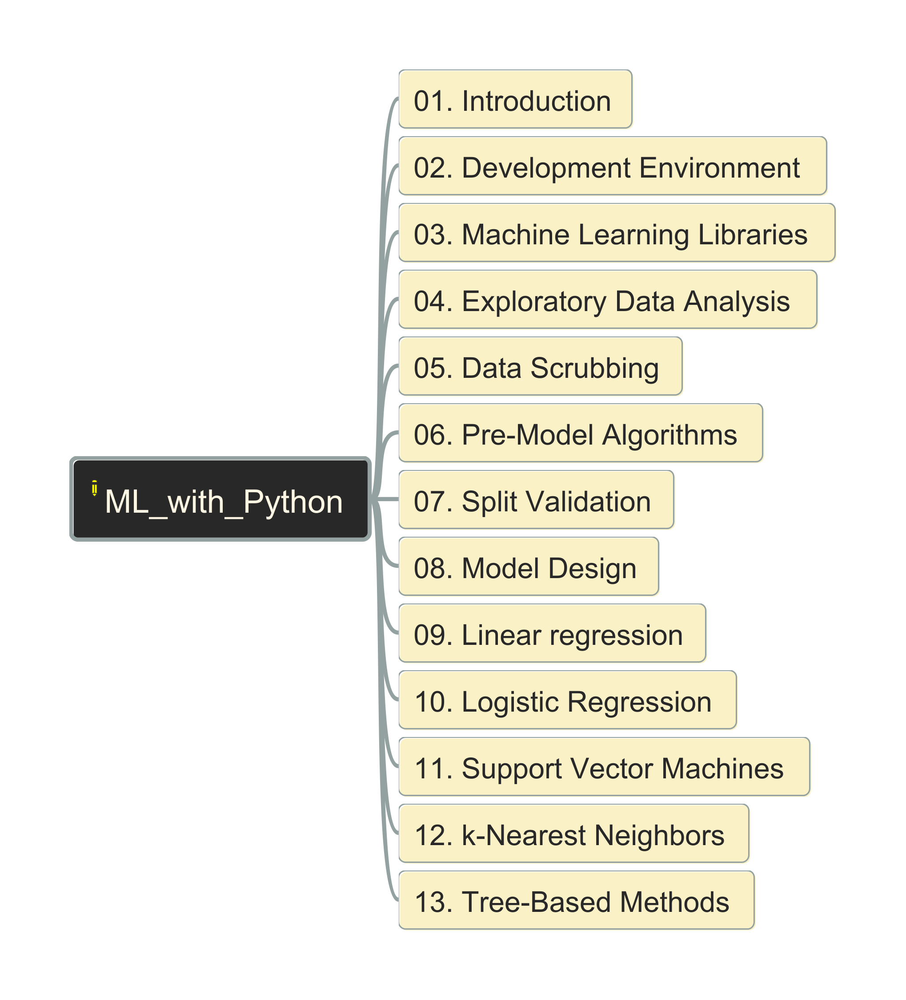

# Practicing "Machine Learning" with Python

- [Practicing "Machine Learning" with Python](#practicing-machine-learning-with-python)
  - [Content Structure](#content-structure)
  - 

## Content Structure

</img>

##