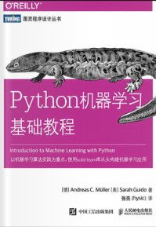
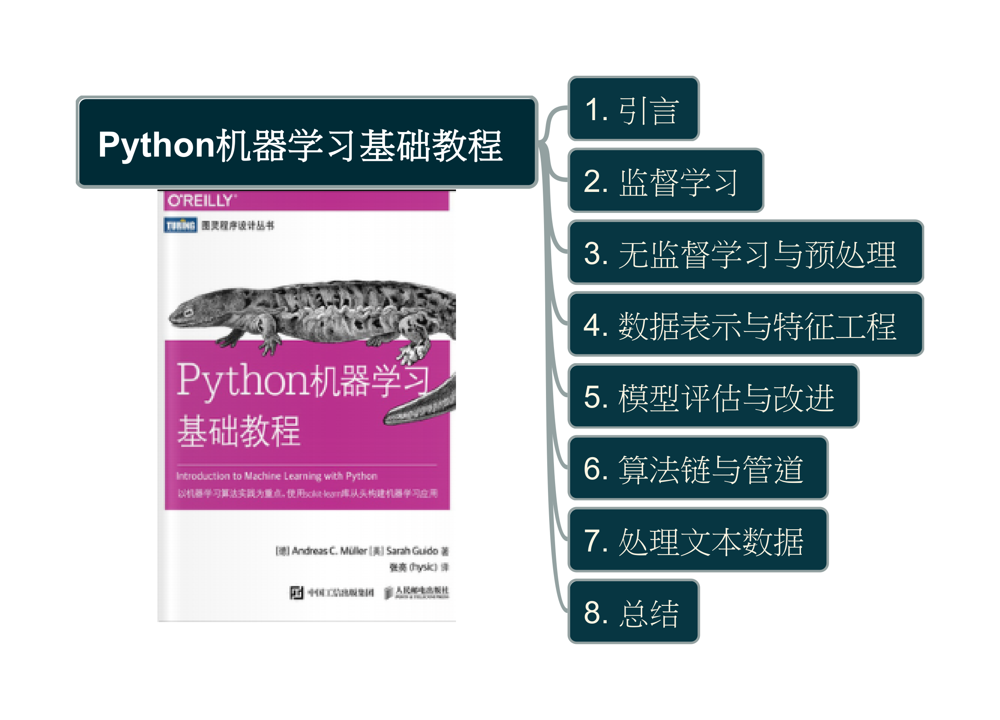

# Python机器学习基础教程

| Author | Book Cover |
| --- | ---|
| Andreas C.Müller Sarah Guido |  |

- [Python机器学习基础教程](#python机器学习基础教程)
  - [主要内容](#主要内容)
  - [用到的工具](#用到的工具)
  - [参考书籍](#参考书籍)

## 主要内容

| 章节 | 内容概略 |
| --- | --- |
| [第1章](ch1/README.md) | 介绍机器学习的基本概念及其应用，并给出本书会用到的基本设置 |
| [第2章](ch2/README.md)和[第3章](ch3/README.md) | 介绍实践中最常用的机器学习算法，并讨论这些算法的优缺点 |
| [第4章](ch4/README.md) | 介绍在机器学习中待处理数据的呈现方式的重要性，以及应重点关注数据的哪些方面 |
| [第5章](ch5/README.md) | 介绍模型评估和调参的高级方法，重点在交叉验证和网格搜索 |
| [第6章](ch6/README.md) | 解释管道的概念，用于串联多个模型并封装工作流 |
| [第7章](ch7/README.md) | 介绍如何讲前面各章讲述的方法应用到文本数据上，并介绍一些文本特有的处理方法 |
| [第8章](ch8/README.md) | 全书总结，并介绍有关更高级主题的参考资料 |

## 用到的工具

- Python
- scikit-learn library
- NumPy
- matplotlib

## 参考书籍

- Trevor Hastie、Robert Tibshirani和Jerome Friedman合著的[《统计学习基础》](https://hastie.su.domains/ElemStatLearn/)​（Elements of Statistical Learning,Springer出版社）