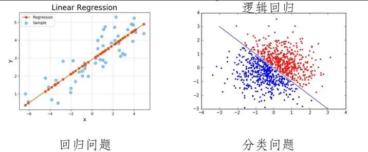
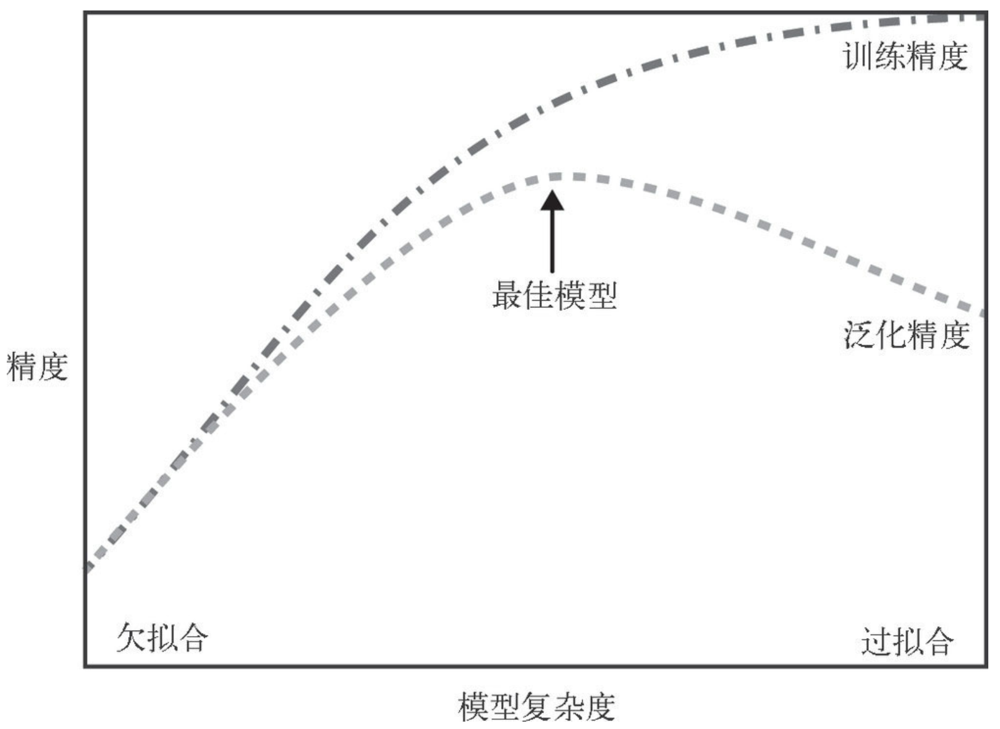

# 第二章 监督学习

- [第二章 监督学习](#第二章-监督学习)
  - [2.1 分类与回归](#21-分类与回归)
  - [2.2 泛化、过拟合与欠拟合](#22-泛化过拟合与欠拟合)
  - [2.3 监督学习算法](#23-监督学习算法)
  - [2.4 分类器的不确定度估计](#24-分类器的不确定度估计)

监督学习是最常用也是最成功的机器学习类型之一。每当想要根据给定输入预测某个结果，并且还有输入/输出对的示例时，都应该使用监督学习。

## 2.1 分类与回归

分类与回归的根本区别在于输出空间是否为一个度量空间。

两个问题本质上都是要建立映射关系：$f(x) \rightarrow y, x \in A, y \in B$

| | 分类问题(classification) | 回归问题(regression) |
| --- | --- | --- |
| 目标 | 将实例数据划分到合适的类别中 | 用于预测数值型数据 |
| 例子 | - 将鸢尾花分到三个可能的品种之一 - 垃圾邮件分类 - 判断网站是否被黑客入侵（二分法） - 手写数字的自动识别（多分类） - 多目标分类（多分类） | - 股票价格波动的预测 - 房屋价格的预测 - 根据教育水平、年龄和居住地预测一个人的年收入 - 根据上一年的产量、天气和农场员工数等属性预测玉米农场的产量 |
| 输出 | - 物体所属的类别 - 值是离散的（有限个类别） - 值是定性的 | - 物体的值 - 值是连续的（理论上可以取某一范围内的任意值） - 值是定量的 |
| 目的 | 寻找决策边界，即得到一个决策面，用于对数据集中的数据进行分类 | 找到最优拟合，即得到一个最优拟合线，这个线条可以最好的接近数据集中的各个点 |
| 输出空间$B$ | 输出空间$B$不是度量空间，即所谓“定性”。 也就是说，在分类问题中，只有分类“正确”与“错误”之分，至于错误时时将Class 5分到Class 6，还是Class 7，并没有区别，都是在error counter上加1。 | 输出空间$B$时一个度量空间，即所谓“定量”。 也就是说，回归问题的输出空间定义了一个度量$d = F(y_{true},y_{pred})$去衡量输出值与真实值之间的“误差大小”。（所有有了均方误差这类误差函数） |
| 结果 | 分类的结果没有逼近，对就是对，错就是错，什么类别就是什么类别，最终结果只有一个 | 回归是对真实值的一种逼近预测，值不确定，当预测值与真实值相近时，误差较小，认为时一个好的回归 |
| 评估指标 | 在监督分类中，通常会使用准确率作为指标，也就是预测结果中分类正确数据占总数据的比例 | 在回归中，用决定系数$R$平方来评估模型的好坏，$R$平方表示有多少百分比的$y$波动被回归线描述 |

所谓的离散与连续的差别时分类与回归的不同的表象，而非本质，本质在于损失函数的形式不同。

Source: https://zhuanlan.zhihu.com/p/589535856

## 2.2 泛化、过拟合与欠拟合

在监督学习中，我们想要在训练数据上构建模型，然后能够对没见过的新数据（这些新数据与训练集具有相同的特性）做出准确预测。

如果一个模型能够对没见过的数据做出准确预测，我们就说这个模型能够从训练集**泛化(generalize)**到测试集。$\rightarrow$ 我们想要构建一个泛化精度尽可能高的模型。

判断一个算法在新数据上表现好坏的**唯一度量**，就是在测试集上的评估。
- 构建一个对现有信息量来说过于复杂的模型，称为**过拟合(overfitting)**
- 若模型过于简单，无法抓住数据的全部内容已经数据中的变化，称为**欠拟合(underfitting)**

过拟合和欠拟合之间存在一个最佳位置，可以得到最好的泛化性能，此即为我们想要的模型。

上图表示了模型复杂度与训练数据集中输入的变化之间的关系：数据集中包含的数据点的变化范围越大，在不发生过拟合的前提下可以使用的模型就越复杂。

## 2.3 监督学习算法

[2.3_supervised-learning-algorithm](2.3_supervised-learning-algorithm.ipynb)

## 2.4 分类器的不确定度估计

---

Last updtaed at 2026-02-22