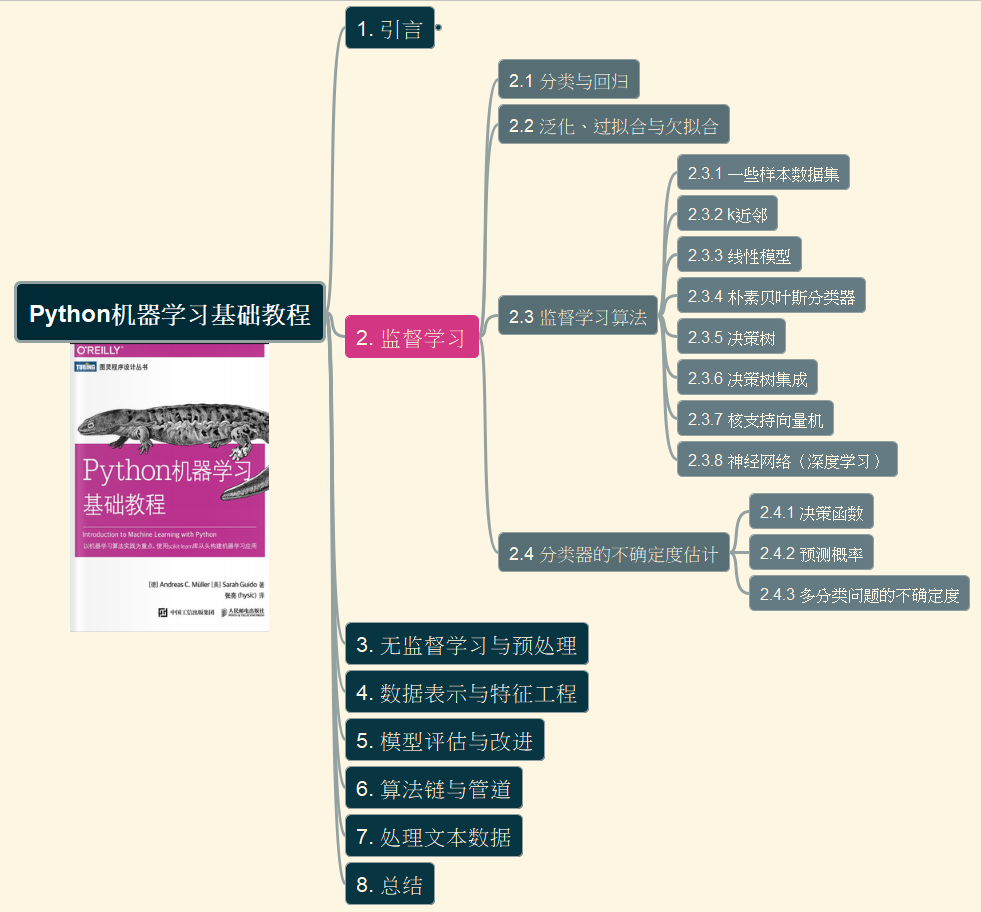

# 第二章 监督学习

- [第二章 监督学习](#第二章-监督学习)
  - [2.1 分类与回归](#21-分类与回归)
  - [2.2 泛化、过拟合与欠拟合](#22-泛化过拟合与欠拟合)
  - [2.3 监督学习算法](#23-监督学习算法)
  - [2.4 分类器的不确定度估计](#24-分类器的不确定度估计)

## 2.1 分类与回归

## 2.2 泛化、过拟合与欠拟合

## 2.3 监督学习算法

## 2.4 分类器的不确定度估计

---

Last updtaed at 2026-02-22