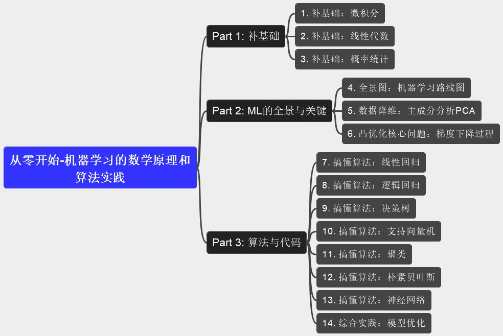

# Machine Learning

## Supervised vs Reinforcement vs Unsupervised

Thanks for source: https://www.geeksforgeeks.org/supervised-vs-reinforcement-vs-unsupervised/

| Item | Supervised Learning | Reinforcement Learning | Unsupervised Learning |
| :-- | :-- | :-- | :-- |
| Deinition | Supervised learning is akin to learning with a teacher. In this paradigm, the algorithm is trained on a labeled dataset, which means that each training example is paired with an output label. The goal is for the model to learn a mapping from inputs to outputs so that it can predict the output for new, unseen inputs. | The Reinforcement learning (RL) is an interactive type of machine learning where an agent learns to make decisions by the interacting with its environment. The agent takes actions and receives rewards or penalties based on its performance with the aim of maximizing the cumulative rewards over time. | The Unsupervised learning deals with the data that has no labeled outcomes. The model is tasked with the identifying patterns, structures or relationships within the dataset. Since there are no labels, the model doesn’t receive direct feedback or guidance on what the correct output should be. |
| Key Characteristics | - **Labeled Data**: Supervised learning requires a dataset where the input data is labeled with the correct output. This allows the model to learn by comparing its predictions with the actual outcomes and adjusting accordingly. - **Types of Problems**: It is primarily used for classification and regression problems. Classification involves predicting discrete labels (e.g., spam or not spam), while regression involves predicting continuous values (e.g., house prices). - **Algorithms**: Common algorithms include linear regression, logistic regression, support vector machines (SVM), decision trees, and neural networks. | - **Interaction with Environment**: The agent learns by taking actions in an environment to maximize cumulative reward overtime. - **No Labeled Data Required**: Unlike supervised learning, RL does not require labeled input/output pairs but learns from feedback received from its actions. - **Algorithms**: Includes Q-learning, SARSA (State-Action-Reward-State-Action), and Deep Q Networks (DQN). | - **Unlabeled Data**: The model works with data that has no predefined labels. It tries to find hidden structures or groupings in the data. - **Types of Problems**: Commonly used for clustering and associaton tasks. Clustering involves grouping similar data points together, while association involves discovering interesting relations between variables. - **Algorithms**: Popular algorithms include K-means clustering, hierarchical clustering, principal component analysis (PCA), and autoencoders. |
| Types | - **Classification**: The model predicts a categorical label. e.g. detecting if an email is spam or not. - **Regression**: The model predicts continuous output. e.g. predicting house prices on historical data. | - **Model-Free RL**: The agent learns directly experiences by interacting with the environment. - **Model-Based RL**: The agent builds a model of the environment and uses it to plan actions and predict outcomes. | - **Clustering**: Identifies groups of similar data points. e.g. includes K-Means and Hierarchical Clustering. - **Association**: Finds relationships between variables in a dataset. Market baseket analysis is a common use case, where retailers discover products that are frequently bought together. |
| Pros | - **High Accuracy**: Because the model is trained on labeled data, it can achieve high predictive accuracy for specific tasks. - **Interpretability**: Since the model is trained with known output, it is easier to understand how predictions are made.| - **No Labelled Data Required**: It works without the need for labeled data, making it suitable for exploratory analysis. - **Discover Hidden Patterns**: It is used for discovering patterns or structures that may not be immediately apparent in the data. | - **Autonomy**: The agent learns autonomously by exploring the environment. - **Adaptability**: The agent can adapt to new environments or situations over time, continuously improving its performance. |
| Cons | - **Data Labeling Requirement**: Acquiring labeled data is time-consuming and costly. - **Overfitting**: Models may memorize training data and fail to generalize well on unseen data. | - **Less Accurate**: The lack of labels makes it harder to validate model accuracy compared to supervised learning. - **Interpretability Issues**: Results are often more difficult to interpret than in supervised learning since there is no ground truth for validation. | - **Complexity**: Requires a large amount of data and computation, as well as precise tuning of rewards and penalties. - **Unstable Training**: The learning process can be unstable, with the agent sometimes converging to suboptimal behaviors. |

## 知识学习

### Python机器学习(第三版)

|  | 
| --- | --- |

### 从零开始-机器学习的数学原理和算法实践

- [从零开始-机器学习的数学原理和算法实践](从零开始-机器学习的数学原理和算法实践.mm)

|  | 
| --- | --- |

### 机器学习基础

---

# Reference on Machine Learning

- Linear Algebra Review and Reference: [Link from cs.cmu.edu](https://www.cs.cmu.edu/~zkolter/course/15-884/linalg-review.pdf), [direct_PDF](ref/Linear-Algebra-Review-and-Reference.pdf)
- [Computational Methods for the Smart Grid](https://www.cs.cmu.edu/~zkolter/course/15-884/)

## Machine Learning Engineer Roadmap

