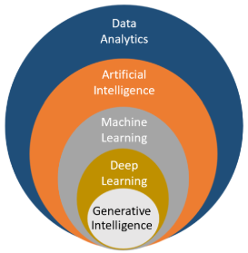

# Artificial Intelligence, Machine Learning, and Deep Learning

> A comprehensive learning repository and knowledge base for AI, ML, DL, and Data Science.

---

## 📌 Overview

This repository serves as a centralized hub for mastering the core pillars of modern data intelligence. It includes structured notes, theoretical foundations, and practical insights into:

* 📘 [**AI - Artificial Intelligence**](./AI/README.md)
* 📙 [**ML - Machine Learning**](./ML/README.md)
* 📗 [**DL - Deep Learning**](./DL/README.md)

---

## 🗺️ Visualizing the Ecosystem

The following illustration demonstrates the hierarchical and overlapping relationships between Artificial Intelligence, Machine Learning, Deep Learning, and Data Analytics.

*Source: [Anang B. Singh (LinkedIn)](https://www.linkedin.com/pulse/how-does-ai-ml-dl-gi-fit-together-anang-b-singh/)*

---

## 📊 High-Level Comparison: AI vs ML vs DL

Understanding the nuances between these fields is critical for applying the right technology to the right problem.

| Feature | Artificial Intelligence (AI) | Machine Learning (ML) | Deep Learning (DL) |
| :--- | :--- | :--- | :--- |
| **Core Concept** | AI simulates human intelligence to perform tasks and make decisions. | ML is a subset of AI that uses algorithms to learn patterns from data. | DL is a subset of ML that employs artificial neural networks for complex tasks. |
| **Data Requirements** | May or may not require large datasets; it can use predefined rules. | Heavily relies on labeled data for training and making predictions. | Requires extensive labeled data and performs exceptionally with big datasets. |
| **Human Intervention** | Can be rule-based, requiring human programming and intervention. | Automates learning from data and requires less manual intervention. | Automates feature extraction, reducing the need for manual engineering. |
| **Scope** | Can handle various tasks, from simple to complex, across domains. | Specializes in data-driven tasks like classification, regression, etc. | Excels at complex tasks like image recognition and NLP. |
| **Complexity** | Algorithms can be simple or complex, depending on the application. | Employs various algorithms like decision trees, SVM, and random forests. | Relies on deep neural networks with numerous hidden layers. |
| **Resources** | May require less training time/resources for rule-based systems. | Training time varies with algorithm complexity and dataset size. | Demands substantial computational resources (GPUs) and time. |
| **Interpretability** | Often offers interpretable results based on human rules. | Models can be interpretable or less interpretable based on the algorithm. | Often considered "black boxes" due to complex architectures. |
| **Applications** | Virtual assistants, recommendation systems, expert systems. | Image recognition, spam filtering, predictive analytics. | Autonomous vehicles, speech recognition, advanced AI research. |

*Source: [Analytics Vidhya](https://www.analyticsvidhya.com/articles/machine-learning-vs-artificial-intelligence-vs-deep-learning/)*

---

## 🛠️ Stack & Tools

To maintain and visualize the knowledge within this repository, the following tools are utilized:

* **Language:** Python 3.x
* **Modeling:** [FreePlane](https://docs.freeplane.org/) (Open-source mind mapping tool for structured thinking)

---

## 💬 Connect & Contribute

Suggestions and questions are always welcome! You can engage with the project through the following channels:

* **Email:** [xiaoqizhao@outlook.com](mailto:xiaoqizhao@outlook.com)
* **Discussion:** [GitHub Discussion Board](https://github.com/yasenstar/ai-ml-dl/discussions)

---

**License**
Distributed under the GPL-3.0 License. See `LICENSE` for more information.